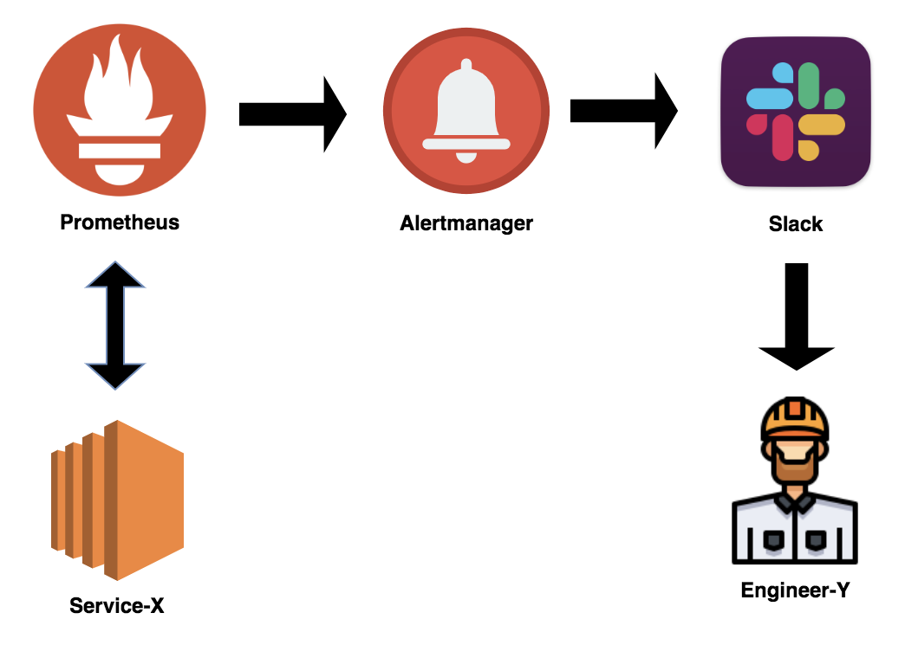
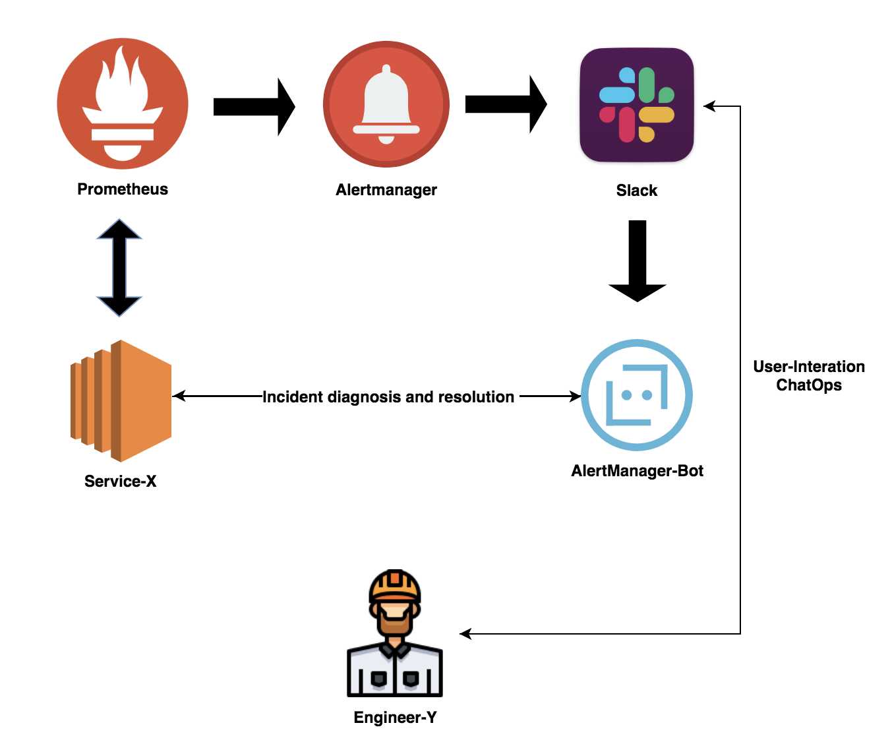

## Introduction

I got back from holiday 2 weeks ago, and while I was lying on the beach, I enjoyed reading Brendan Gregg's book "System Performance: Enterprise and the Cloud". First, let me say that this book is awesome, it has been in my "to read" list for a long time, and now I'm so happy to have it between my hands.

Chapter two of the book illustrates some interesting analysis methods and I'm going to talk about one of them and how can be applied in another context.

The method is called “Ad Hoc Checklist Method” and is described as follow:

"Stepping through a canned checklist is a common methodology used by support professionals when asked to check and tune a system, often in a short time frame. 
A typical scenario involves the deployment of a new server or application in production, 
and a support professional spending half a day checking for common issues now that the system is under real load.”

This article will walk you through "The concept of auto-diagnosis and actionable alerts on IT infrastructures" using the method explained above.
Even if I'll mention some existing tools, this is not a tutorial, but a concept/idea.

## Concept

Nowadays a lot of tools and platforms help us to have wide and detailed visibility across IT infrastructures.

90-99% of the time these tools are more than enough, but what about the remaining 1-10% ?

When something occurs, and your monitoring setup didn't prevent the incident from happening, is there anything that could help you to have a faster analysis of your systems?

Let's analyze what humans do when an incident occurs.

First, there are "roles". Usually, when it is time to handle incidents there is an incident commander, an incident officer and a bunch of SMEs (Subject Matter Experts). They all work together to solve the issue as fast as possible.

We will focus on what the SME does. Usually, the SME try to get as much information as possible to have a clear visualization of the incident and the infrastructure, part of this information could come from monitoring tools, others from logs, others from completely different platforms logs and so on.

I truly believe that in the same way logs can provide solutions instead of presenting the problem (e.g.: "git cmmit" --> will print: The most similar command is "git commit") monitoring tools can provide a better diagnosis and actionable alerts instead of only reporting the problem.

Let's picture the following scenario.

## Scenario

It's 1 AM and there is a network partition error. One of our distributed systems is not able to determine who is the leader of the cluster and new workloads cannot be applied on Service-X.

Engineer-Y receives an alert from Prometheus which is the monitoring system implemented in the company.

The monitoring system works like this:



* Service-X expose some metrics
* Prometheus evaluate those metrics against its alert rules
* If there is a match send an alert to the Alertmanager
* The Alertmanager triggers a Slack notification 
* Engineer-Y has now been alerted

The alert says: 
New workload cannot be applied to Service-X, in DATACENTER-N due to "network partition error", instances involved are {instance1, 2, 3...}.

Engineer-Y takes his laptop, connect to the instances and notice that there's no connectivity between them on port 12345/TCP, which is the connection used by Service-X.

He also checks if there are bigger issues and, doing that, notice that the security groups of the instances have been changed via Terraform 5 minutes ago from a scheduled job. 
The Terraform code is wrong and somehow it passed all the tests and ended-up in production. 

He fixes the security group manually, open a jira ticket to not forget the issue and perform more investigations the next day, and he goes back to sleep.
**Incident solved!**

Now imagine if the monitoring platform would work like this:



It's 1 AM again and the AlertManager-Bot present to Engineer-Y a bunch of additional information and ask if the engineer needs more help through Slack.

**SLACK CHAT:**

**AlertManager-BOT:**
```
[ALERT] Service-X Failure
Details:
    service: Service-X
    error: "Network partition error..."
    instances: {instance1, 2, 3...}

Analysis:
    [OK] - Disk space on instances
    [OK] - CPU usage on instances 
    [OK] - Related platform issues
    [FAILED] - Connetivity between cluster members
        [SubChecks]
        [OK] - Check internal firewall
        [FAILED] - Check security groups -> connection 12345/TCP blocked.
---
Do you want to edit the security group and restart the cluster?
y/n
```
**Engineer-Y:**
```
y
```

**AlertManager-BOT:**
```
[OK] Security group edited & applied. 
[OK] Restarting Service-X.
```
**AlertManager-BOT:**
```
[OK] Prometheus alert solved.
```
**Engineer-Y:**
```
/jira open ticket 3 "SRE" "Investigate wrong Security Group on Service-X"
```
**Jira BOT:**
```
[SUCCESS] "Ticket SRE-1005" opened.
```

## Scenario consideration

In this case, the AlertManager-Bot is using the analysis method called "Ad Hoc Checklist Method" and taking some actions with the supervision of Engineer-Y.

A situation like that helped Engineer-Y to have a faster resolution and Engineer-Y didn't even need to open the laptop.

I'm pretty sure that right now you're saying/thinking something like: "I wish it will be always so easy", but I truly believe that at least auto-diagnosis can be reached on IT infrastructures and in most of the cases can return an actionable output instead of a plain alert.

## Some Pros and Cons

Pros:
* A potential correlation between business issues and technical issues could be easier to find out and to solve.
* Actionable alerts could solve IT infrastructure incidents faster.
* Actionable alerts could potentially solve issues by themselves without any human interactions.
* Actionable alerts with the help of ML could present more and more accurate diagnosis of IT infrastructures.

Cons:
* It might take a lot of time to maintain and write all those actionable alerts.
* It might be less efficient on very complex infrastructures or distributed systems.
* It requires a deep understanding of your infrastructure.

## What's next?

In the next article, I'm going to show you how to perform unit testing on the Prometheus Alert Rules.

I hope you liked the article, that's all for today!
