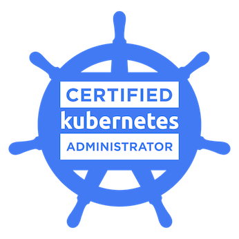

Hello, dear reader!
In the last three weeks, I have been busy preparing for the CKA exam (Certified Kubernetes Administrator), and I'm happy to say that I've passed it.

Therefore, today's article is not going to be an "how-to" or some deep-dive material, but just a list of few tips & tricks that helped me to pass the exam, and hopefully will help you too!

If you don't already know, the exam is 3 hours hands-on and proctored test, and it can be done from your room (Yes, it's COVID-19-friendly!)

The exam has 24 exercises that need to be completed on time; every task has a different value to the final score.
The [CKA Curriculum](https://github.com/cncf/curriculum/blob/master/CKA_Curriculum_V1.18.pdf) can give you a better idea about how the exam is structured.

## 10 TIPS & TRICKS:

1 - **Find your source of knowledge.**

If you don't want to spend too much you can either read the book [Kubernetes in Action](https://www.manning.com/books/kubernetes-in-action/) or follow the [Linux Academy CKA course](https://linuxacademy.com/course/cloud-native-certified-kubernetes-administrator-cka/) which covers about 80/90% of the things that you need to know.
Remember this is a practical exam, so probably an interactive course is a better idea than a book, but that's up to you. I have used both.

2 - **Stick to the course or book and don't skip anything.**

Even if you "already know" the topic, study it, don't skip it. You might learn something new or become more familiar with some commands, or even better learn new ways to do something that you already knew how to do.

3 - **Join a community and ask if things are not clear.**

Personally, I've joined the Kubernetes Slack workspace, but nowadays, there are Kubernetes communities everywhere. I can't tell you which one is the best, but on Slack there are loads of useful channels.

4 - **Become familiar with the official documentation.**

Whenever you don't know something during your studies, and you want to google it, don't. **Use the official documentation first.**
Here's why. During the exam, you will be allowed to have an additional Chrome tab open; you can navigate **only** the official documentation and the Kubernetes GitHub page

5 - **`kubectl --dry-run -o yaml` will save your exam!**

This little kubectl feature will help you to save time during the exam. Simply run it and redirect the standard output to a new file and edit it.
Example:
`kubectl run pod-name --restart=Never --image=pod-image --dry-run -o yaml > editme.yaml`
`vi editme.yaml`

6 - **Avoid deprecated commands.**

Make sure you don't get the habit of running deprecated commands; they will not be allowed during the exam.

7 - **Try an exam simulation. But don't be scared by the result.**

I have personally used killer.sh and it is way harder than the actual certification. So keep that in mind, and don't be frustrated if the simulation didn't go as you planned!

8 - **Enjoy it!**

Kubernetes is a wonderful project, and while some things will not be useful for the exam to try as much as possible and keep doing it.
You might think: why do I need to create a custom controller? Or play with alpha features? Or configure a custom HPA?
Short answer: you don't **need** to, but that's a way to get familiar with Kubernetes and understand the deep dive concepts by doing.

9 - **During the exam: do not forget to change the Kubernetes context.**

At the start of every task, the exam interface will show you the kubectl command to switch to the right context, copy/paste, and run it, always!

*Also, pay attention to details! (e.g., make sure you're always on the right namespace, using/creating the right api-resources)*

10 - Make sure, **before** the exam, that everything works: examslocal.com, your webcam, screen sharing options, your microphone, etc.

## After the exam?

If you are working with Kubernetes then fantastic, you already know what to do. 

If not, well, maybe try to get involved with the Kubernetes community. There are tons of things that need to be done!

I hope this article will be useful for your exam; if so, let me know!
