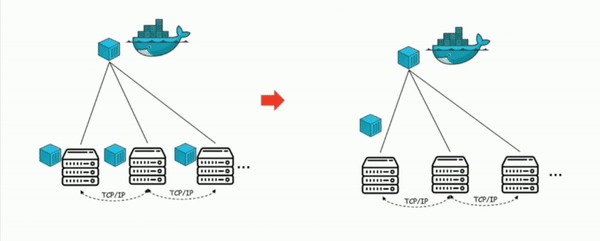

**TL; DR:** This article explains how I implemented Dragonfly on Kubernetes, a general overview of what it is and the advantages/disadvantages that I have found along the way.

## What is Dragonfly?

Dragonfly is a P2P file distribution platform, and it's mostly used as caching layer for container images. Being a distribution layer, Dragonfly doesn't store any data. Instead,  it caches content from configurable storage backends.
 

More information can be found on the following links:
- https://d7y.io
- https://github.com/Dragonflyoss/Dragonfly

I won't go over all the product's specifics, so it's best to go over the Dragonfly documentation before reading this article in order to gain a general understanding.
 
 

## A new model to distribute container images

The common way container images are distributed across environments is by having a centralized solution (1 or more registries) that holds and serve them on-demand. Having a centralized place works under specific circumstances; however, sometimes, it's not the best approach to scale a platform.
 

A way to scale image distribution, and the one used by Dragonfly, is by implementing a P2P network. This means that there is not a centralized cluster or clusters; instead, each member of the P2P network is able to retrieve and serve blocks of data (container images).
 

The following diagrams show the difference in the 2 image distribution models:

 

As we can clearly see, the diagram on the right offers a more efficient model adding little complexity.
 
 

## Dragonfly components

Before getting into how I deployed Dragonfly into the Kubernetes clusters, let's go over Dragonfly's architecture.

Dragonfly comes with 2 major components: supernode & dfclient.

The **supernode** is the most critical component and does the following:

- It's the tracker and scheduler in the P2P network that choose the appropriate downloading net-path for each peer.
- It's also a CDN server that caches downloaded data from the source to avoid downloading the same files repeatedly.
- Manages healthy & unhealthy peers (Adds them into a blacklist)

The second component is the **dfclient**, which is the peer and, in our case, will be deployed on in each node.
Dfclient implements a Docker HTTP/S interface and proxies all the docker layers requests (`.*/sha256/blob/.*`) through the "dfget" tool, which uses the P2P network.
Dfget is nothing more than a CLI (similar to wget) that uses Dragonfly to download data.

**NOTE**: the dfclient is not only used to download from the P2P network, but it also works as peer/server uploading content (blocks of container images) to other peers in the P2P network, for that reason, there's a sub-component called dfserver.
 
 

## How I integrated Dragonfly with Kubernetes

### Deployment

There are different ways to deploy Dragonfly; the documentation suggests configuring it as registry-mirrors in the docker/containerd configuration. However, I personally preferred to use it "directly", exposing it locally on each Kubernetes node (65001/TCP), letting the CRI download images from '127.0.0.1:65001'. The reason will be evident in a minute when we will go over the configurations and automation there's around it.
 

I've deployed the **dfclient** as `Daemonset` using `Hostnetwork: true` & `DnsPolicy: ClusterFirst` this way, every dfclient in the cluster is able to communicate to each other using the nodes network layer while being able to connect to Kubernetes resources using their internal K8S DNS records. In addition, because the `Daemonset` is using `Hostnetwork` the CRI will be able to download images directly from 127.0.0.1:65001 as mentioned above.
 

I've decided to use a Stateful set to deploy the **supernode**. The reason is that the supernode doesn't implement High Availability, meaning you need to pass to the dfclient a list of supernodes. The dfclient will then determine to which one it should connect based on the supernodes availability/connections.

By deploying the supernode as Statefulset is possible to have pods with predictable names/DNS records. This means that through the helm chart, I can automate the dfclient configuration to something like -> if there are three supernodes, configure the dfclient with the following: "supernodes: pod1, pod2, pod3.

That's also the reason why the dfclient needs `DnsPolicy: ClusterFirst` so that it will be able to connect to the supernode using its StatefulSet DNS records.
 
 

### Admission webhook

To make it easier for our users, we decided to implement an Admission Webhook that mutates the image registry address from the standard one to 127.0.0.1:65001. Doing this way, the users don't need to know when to use Dragonfly and when they shouldn't.
 
 

### Conclusion

You might also want to tweak the default configuration of the dfdaemon/supernode to make them work with private registries, increase the alive time of the peers, increase the maximum disk space for cached files and so on.

One final thing to say, the community is working hard to release a new version of Dragonfly (see https://github.com/dragonflyoss/Dragonfly2). I strongly believe this project is well maintained and done, it has a strong community, and it has a future in the cloud-native space!