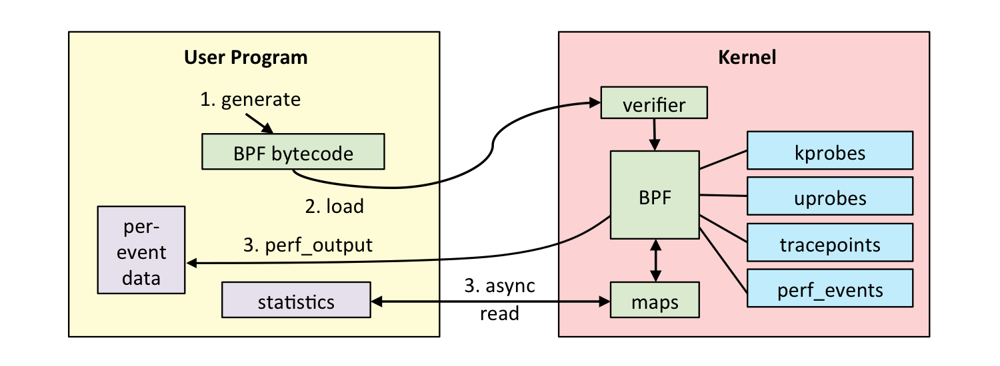

## How I ended up studying eBPF!?

In the last two months, I have noticed a lot of posts, tweets, and articles talking about eBPF.
I was annoyed by that "hype", because I didn't know absolutely anything about it.

So, I googled it, and it turned out it was a new version of BPF (yes the Berkeley Packet Filter) with an 'e' as first letter :(. At the time I decided to not get involved since I thought "just a packet filter" and nothing else.

But two days ago, I have read about it in a detailed article. My only thought was: **"I absolutely need to understand learn it!"**.

Well, I've done my homework and tried to get as much info as I could in just 2 days.

## What I have learned so far...?

eBPF which stands for "extended Berkeley Packet Filter", is an in-kernel virtual machine that allows userspace programs to be executed in the kernel directly after they succeeded several checks.

It can be used to achieve network performance improvements, SDN, security improvements and to have a better kernel debugging/tracing on your systems.
In this article, we’ll focus more on its use for analysis purposes.

**NOTE**: in case I will mention BPF, don't get confused I'm always referring to eBPF.

**What so special about it?**

*Do you remember when you had to writes kernel modules to get data and/or perform debugging on the Kernel itself? Or maybe solve some system performance issue?*

Well, I don't :D Never done it before and TBH I always thought it was **insane**. Very nerdy, tho.

But, it looks like that thanks to eBPF there is less need of those "insane kernel modules".

**Why?**

Well, let's see dive a bit inside the eBPF workflow:

As you can see from the picture above the BPF programs reside in the user space, probably generated by a frontend software (we'll talk about frontend software later on a different post), the BPF code then will be sent to the BPF VM (which is a register virtual machine and not a stack VM, I'm assuming for performance reasons), and before execute the code, the kernel, has to be sure that your BPF program is safe!

**How it does that?**

By running some checks and sandboxing the code that needs to be executed. I'll probably write another post, in which I'll cover in detail all the checks performed by the kernel, but to give you an example: you cannot submit unreachable code, loops, etc otherwise your code will be rejected.
Anyway, finally, your code has passed the verifier checks and now the fun part. What makes this feature/tools so incredible is that you can actually attach your code to Kprobes, Jprobes, tracepoints (If you don't know what those are and you can't wait for my next post next week-ish, well I'm afraid you'll need to search elsewhere :( ).

**The ADVANTAGE:**
*Instead of dumping all the kernel events and post-process them, you can actually get only the data you need from those probes and tracepoints which eBPF use as data sources. This will help a lot your infrastructure observability, in particular when it comes to kernel tracing and debugging.*

**How the early retrieved data come back to the userspace?**

They come back through eBPF maps.
Maps are a data structure, a sort of dictionary, k/v array. Through this data structure BPF can actually transfer the data to the u-space.

Ok, that's it for today If I wasn't clear... Well, it has been just 2 days D:

Cheers ;)