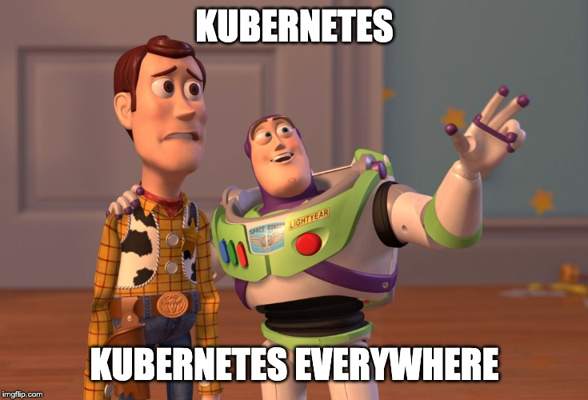
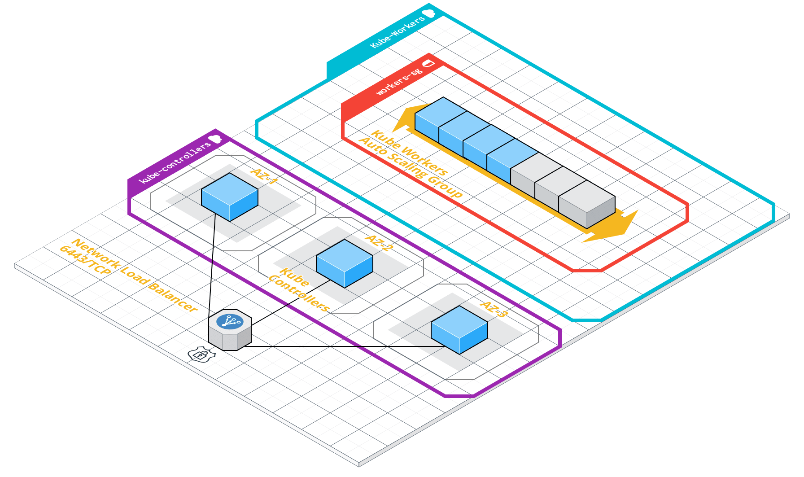

Today, I am going to tell you what I've been working on during the last month. I'm still doing it, but with much less effort right now.

And the project is ...

** drumroll ** 

**Another Boring Kubernetes Bootstrap tool!**

Before judging me, you must know the reasons why I started it.

**First:** I wanted to get more involved in an end-to-end Kubernetes implementation and spend time on each component.

**Second:** I thought that a Terraform-only solution was a good idea, also to keep my "terraform skills" up-to-date.

**Third:** I wanted to implement a fully encrypted and secure setup and understand some best practices about it.

## How I started it?

I have always been fascinated by the containers world, starting from the very deep dive Linux concept to the high-level orchestrators.

Last month I had some time to invest and I wanted to do something about it.
It didn't matter if it was something already done by others, or not so innovative, the only thing I thought was "let's do it" and that's how I started a Kubernetes Bootstrap tool.

The motto was and still is: **Think Big, Start Small, Learn Fast**.

So I started working on small cycles, where a cycle is not longer than 3 days and I wanted to put an effort of at max 3 hours per day.

After every cycle, I used to test every component, enjoy what I did to gain some self-motivation and bother my girlfriend showing her things she didn't care about! :D

- #### 1st Cycle
    -   Create 3 instances (Kubernetes Controllers) based on AMI {AMI_ID} - [ Terraform ]
    -   Develop 2 scripts to setup ETCD and the Kube Control Plane (API Server, Control Manager, Scheduler) - [ BASH ]
- #### 2nd Cycle
    - Provision a self-signed CA and TLS certificates for controllers [ Terraform Module ]
    - Setup a Load Balancer for controllers [ Terraform ]
- #### 3rd Cycle
    -   Setup RBAC on controllers for workers [ BASH ]
    -   Create ASG (Auto Scaling Group) for workers [ Terraform ]
- #### 4th Cycle
    -   Create a bootstrap script for workers [ BASH ] * in progress
    -   Create a drain and cordon system for dead workers [ BASH ] * in progress
- #### 5th Cycle
    -   Modularize the Terraform code * to do
    -   Security hardening on the AMI * to do
    -   Security checks on Kubernetes implementation [ Manual/BASH ] * to do
    -   Improve security on the AWS side [ Terraform ] * in progress

As you can see the library is still in progress and it will be for a while as I'm adding things to do on it every day.

The current result can be represented like this:

The code is stored on a Github public repository and as per license feel free to use it.

https://github.com/ish-xyz/kubernetes-on-aws

## What I have learned so far?

- Starting with a very small implementation helped me out a lot.

- Reviewing the work and talking with people about it, pushed my motivation.

- Celebrate (even alone) some little success really helps. It might be something small like: "The Kubelet finally doesn't show any errors and the certificates are correct" !!

- Starting with security as a central topic might make things a little bit complicated, but it's a good mindset to have.

- Explain to non-technical people what you're doing helps to check if you're still doing things with logic and you're not too detached from the real world :).

## What's next?

The idea is to create a wide range of building blocks based on Terraform to allow users to create their own **complex infrastructure/platform in a simple way**.

Some ideas might be [Kubernetes w/ Jaeger + Prometheus] OR [Kubernetes w/ Cassandra + Hashicorp Vault] and so on.

The project is really basic right now and there are a lot of aspects to improve or add, starting from a good testing strategy and a CI flow ( I know... my bad! ), but if you would like to help me out on this or maybe just drop a comment, I would love to hear your opinion!

That's all for today, stay tuned!