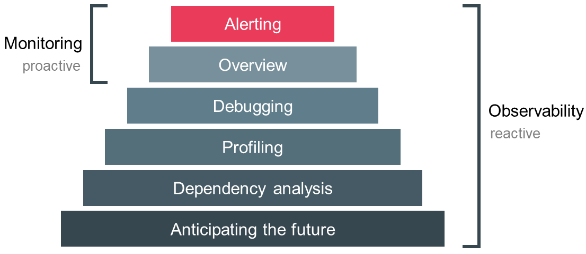
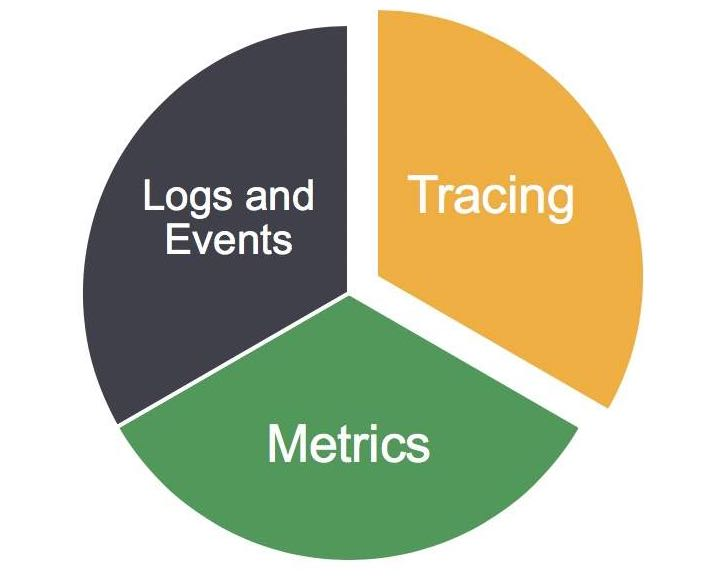

Observability is not a new concept. Indeed, it comes from the world of engineering and control theory.
As per definition, **observability** is a measure of how well internal states of a system can be inferred from knowledge of its external outputs.

So this means that your old monolith application must now expose its internal status, metrics, have tracking details about exceptions or crashes, and a lot more, to define it as "**observable**."

As you can see, observability comes with a lot of different aspects, and it may be unclear at first glance. In this article, I will try to explain it simply and efficiently. We will consider what's the difference from monitoring, the **Three Pillars of Observability**, and finally, the existing standard tools.

## 1 - Observability vs. Monitoring: what's the difference?

We have now convinced our organization to move towards **observability**.
But from different departments, a question arises: what's the difference between observability and monitoring?

Well, to answer that question, let's remind us of what monitoring is.
As the word suggests, "monitoring" is an action. 
It's the action that one system performs against another to check if it works just fine. Our monitoring system should just answer two simple questions: "What?" and "Why?".
These two simple questions can be answered, combining blackbox and whitebox monitoring.

As I have quoted above, **observability** "is a measure of how well internal states of a system can be inferred from knowledge of its external outputs." and so can be viewed as a superset of monitoring with more specifications and details about our system.

Furthermore, when we think about monitoring, we think about something that is failure-driven, it's built to prevent incidents, and it helps engineers to solve them as quickly as possible.
But when it comes to observability, it is not failure-driven. Instead, engineers might use it to debug systems, perform test analysis, run production inspections, and so on.

Then, **why do we need both?**

Think about this: A developer from your company changes some critical code path to introduce a new cool feature. Unfortunately, this causes a malfunction in the final product function. Your well-engineered monitoring system can return what is broken and why (**which is essential**). However, it will not give you details such as single-process tracing, load testing results, system profiling, or exceptions, and that's not because it's not good enough but only because it's not what is supposed to do. Indeed,  the monitoring system is only returning our developer just a memory usage alert and the related non-working service. Wouldn't it be great to have a detailed tracing with the related memory usage to understand where the memory leak is? Or, some testing results to compare other environments with production?
Here is where observability comes to help, and that's why it can be considered as a superset of monitoring.

We also need to acknowledge that when it comes to standard IT infrastructures, there is a lot of monitoring systems that come with out of the box features to provide a bit of observability on the OS, hardware, or even services level.
And sometimes, as we will consider later, the business doesn't even need to go further than that.

On the other hand, when we're talking about: custom software, sophisticated web platforms, or distributed systems, having an observable implementation might provide some essential information for the product and so the business.

Nowadays, we see products becoming more and more complex with new features and new reliability standards.
From an engineering point of view, IT infrastructures are evolving into new patterns such as microservices, polyglot persistence, containers to decoupling the big old monolith into small systems, which is optimal for products but a little bit complicated for engineers.
The amount of available tools is also increasing drastically; there are so many platforms and different ways for empowering humans to do cool new stuff. 
To successfully deliver and run your product under these conditions, you need **observability**.

## 2 - The Three Pillars of Observability

### Metrics

From Cindy's Book (Distributed Systems Observability):
"Metrics are a numeric representation of data measured over intervals of time. Metrics can harness the power of mathematical modeling and prediction to derive knowledge of the behavior of a system over intervals of time in the present and future.
Since numbers are optimized for storage, processing, compression, and retrieval, metrics enable longer retention of data as well as easier querying. This makes metrics perfectly suited to building dashboards that reflect historical trends. Metrics also allow for a gradual reduction of data resolution. After a certain period of time, data can be aggregated into daily or weekly frequency."

Metrics help us to define and measure SLO's on our services, measure everything that happens in our distributed system.
As per the definition, an observable system must also be a measurable system.

### Distributed Tracing

Distributed tracing it's becoming more and more critical as we move towards micro-* architectures, where all those little systems work together to satisfy scaling and reliability requirements.

Distributed tracing helps engineers to identify bottlenecks across vast infrastructures.

It can also be a critical component when it comes to performance analysis and improvements in your product.

### Logging

Your infrastructure is always producing logs. It doesn't matter if they are warning, info, error, or critical logs. They're always happening. 
With a growing complex distributed system is essential that you keep an eye on your logs. Doing so might be very tiring if you don't have the right infrastructure to ingest, elaborate, and show logs to you.

For that reason, there are multiple tools that help you to gather logs and have smart management of them. 
By tracing requests, you can easily see where bottlenecks are, but with logging, you can debug them and provide insights on how to resolve bugs, improve the product performance, and so on.

## 3 - My recommended observability tools.

Let's get to the practice. Here's a list of my favorite observability tools and a short description of them.

### Tracing:

#### Jaeger

Jaeger, inspired by Dapper and OpenZipkin, is a distributed tracing system released as opensource by Uber Technologies. It is used for monitoring and troubleshooting microservices-based distributed systems, including:

- Distributed context propagation

- Distributed transaction monitoring

- Root cause analysis

- Service dependency analysis

- Performance/latency optimization

Source: www.jaegertracing.io

#### Linux eBPF

eBPF is useful for debugging the kernel and carrying out performance analysis; programs can be attached to tracepoints, kprobes, and perf events. Because eBPF programs can access kernel data structures, developers can write and test new debugging code without having to recompile the kernel. The implications are obvious for busy engineers debugging issues on live, running systems. It's even possible to use eBPF to debug user-space programs by using Userland Statically Defined Tracepoints.
The power of eBPF flows from two advantages: it's fast, and it's safe. To fully appreciate it, you need to understand how it works.

Source: lwn.net/Articles/740157

### Metrics:

#### Prometheus

Prometheus is an open-source systems monitoring and alerting toolkit originally built at SoundCloud.
Prometheus's main features are:
a multi-dimensional data model with time series data identified by metric name and key/value pairs
PromQL, a flexible query language to leverage this dimensionality
no reliance on distributed storage; single server nodes are autonomous
time-series collection happens via a pull model over HTTP
pushing time series is supported via an intermediary gateway
targets are discovered via service discovery or static configuration
multiple modes of graphing and dashboarding support

Source:  prometheus.io

### Logging:

#### Elastic Stack

Elasticsearch, Logstash, and Kibana (formerly known as the ELK Stack, now renamed to the Elastic Stack with the addition of Beats) deliver actionable insights in real-time for almost any type of structured and unstructured data source, at any scale. From centralizing infrastructure logs, traces, and metrics to deliver a great end-user experience to keeping a pulse on your fleet of smart devices using real-time telemetry - the possibilities are endless with the Elastic Stack.
Thousands of organizations worldwide are using the Elastic Stack for various mission-critical use cases, and we'd like to show you how you can get started with it for yours.
Whether you call it the ELK Stack or the Elastic Stack, this introductory webinar will offer a live demo of the key features of Elasticsearch, Kibana, Beats, and Logstash.

Highlights include:
Ingesting data into Elasticsearch, including a look at how modules simplify that experience
Exploring and searching your data via Kibana, including building custom visualizations
Keeping track of changes via machine learning-based anomaly detection and alerting
Demonstrating the value of bringing logs and metrics into a single platform

Source: www.elastic.co/webinars/introduction-elk-stack

#### Bonus:

**Stackdriver** is Google Cloud’s embedded observability suite designed to monitor, troubleshoot, and improve cloud infrastructure, software, and application performance.
Stackdriver enables you to:

- Efficiently build and run workloads, keeping applications performant and available.

- Collect signals across Google Cloud internal and external apps, platforms, and services.

- Analyze and monitor your operational telemetry.

- Set up appropriate performance and availability indicators.

- Use built-in observability to troubleshoot and improve your applications.

- Automate ops using both out-of-the-box tools and tools customized through programmatic interfaces.

**Key Features:**
*Real-time log management and analysis.*
Stackdriver Logging is a fully managed service that performs at scale and can ingest application and system log data, as well as custom log data from thousands of VMs. Stackdriver Logging allows you to analyze and export selected logs to long-term storage in real-time.

*Built-in observability at scale.*
Stackdriver Monitoring provides visibility into the performance, uptime, and overall health of cloud-powered applications. Stackdriver collects metrics, events, and metadata from Google Cloud Services, hosted uptime probes, application instrumentation, and a variety of common application components.

*Application performance management tools.*
Stackdriver Application Performance Management (APM) includes tools to help you reduce latency and cost, so you can run more efficient applications. With Trace, Debugger, and Profiler, you gain insight into how your code and services are functioning and troubleshoot if needed.

Source: cloud.google.com/stackdriver/

#### Recommended resources:

[**(BOOK) Distributed Systems Observability**](https://www.oreilly.com/library/view/distributed-systems-observability/9781492033431/)

[**(VIDEO) An episode of SRE implements DevOps Video**](https://www.youtube.com/watch?v=SoZZzB-yTOk)

[**(VIDEO) What's Next for Observability**](https://www.youtube.com/watch?v=MkSdvPdS1oA&feature=emb_logo)

## Conclusion

Observability is an amazing topic, and I'm sure we will see more and more about it during this year.
I hope this article made clear the argument and introduced it properly.
If you have any questions, feel free to contact me on [Twitter](https://twitter.com/isham_araia).

Stay tuned :)

