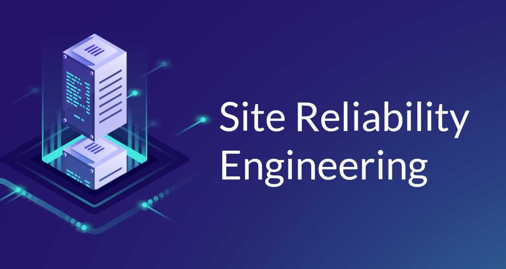
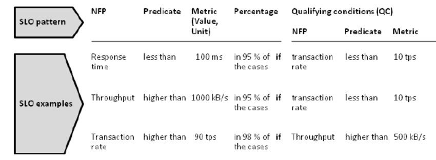

I have finally managed to read the SRE book. It has been in my "book to read" list since forever, and I'm happy that I finally have a little bit of time to read it.
It is such a good feeling to see things I've been doing day after day for years written and explained in a book with beautiful suggestions and inspirations.

Let's get to today's topic: **SLOs & Error Budget!**

## Service Level Objectives.

For who doesn't know what SLOs are, here's a short definition from the book:

"An SLO is a service level objective: a target value or range of values for a service level that is measured by an SLI."

As written above, to define a correct SLO for a specific service, we need to understand what's the actual indicator.

For example, let's say that our service is the-sre-market.io, a famous online store for SREs.
We now define that the key indicators (SLIs) are availability and latency (which is quite common for this kind of service).

After different analyses, we identified that the target availability is 99% of the total time, and the response time cannot be higher than 100ms. Therefore, we have now defined our first two SLOs. 

    NOTE: To define a target SLO you will need to perform tests and analysis.
    It's a good staring point to think about what users really care.
    In addition, remember that is not a tech-only activity and it will 
    most likely needs to involve the business. 
    SREs should be part of this discussion in order to advise 
    on the risks and viability of different options.

    When defining targets remember this points:

        1. Ask yourself what features users care the most.
        2. Don’t pick a target based on current performance.
        3. Keep it simple.
        4. Have as few SLOs as possible.
        5. Done is better than perfect.

It's a good practice to write SLOs in documents like the one reported below, as they most likely become part of a Service Level Agreement (SLA).

When creating an SLO, we want to keep in mind that it's essential to maintain a balanced definition. 
A too high SLO will push the company to move towards an unattainable target or worst, people will stop caring about it and ignore that they even have an SLO.
When it comes to critical systems or services, a good practice is to keep a higher SLO for external customers and a lower one for internal departments. In this way, the company will have a little bit of flexibility when handling incidents.

Site Reliability Engineers want to keep the right balance between product reliability and product development. It's easy to understand why maintaining systems "up & running" is necessary and why keep pushing new features, is vital for the business. Unfortunately, these two aspects go in contrast to each other.
A way to help to address this contrast, described in the SRE book, is defining an error budget.

## What's an Error Budget?

We can define it as the difference between the 100% of a given SLI (such as latency, availability, durability, etc.) and our target SLO (e.g., 99.9% of durability)

We can calculate our error budget like this:

100% - SLO (e.g: 99%) = ERROR_BUDGET (eg.: 1%)

### Example:

Our e-commerce (the-sre-market.io) has an SLO, which says that 99% of the total requests need to be successful over four months (It's a good start to review SLO's every quarter).
The total requests in a quarter are 1.000.000.
In this case, the error budget is (100% - 99% = 1%) -> 1.000 requests.

We have now identified how many requests we can loose before start work on the platform reliability. In other words, this means that until we are under that 1% or 1.000 lost requests, we can keep pushing new features and focus on product development instead of worry about the platform's reliability. 

Sounds great, right? But what if we reach that 1%?
A lot of companies face this situation in different ways, and most of the time it depends on the product itself, a piece of advice from the book is to stop product development and focus on solving reliability problems instead.

## Conclusion

Remember that keeping a balanced SLO and working within an error budget requires discipline, and the entire company needs to be willing to move in the same direction.
In my opinion, it is not something achievable by a single person.

I hope this short article has been useful to you, and it will inspire you either to read the SRE book or to move towards a reliability-oriented development.

See you!
