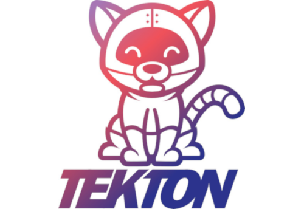

A couple of months ago, I started looking into a relatively new project called ['Tekton'](https://tekton.dev).

As soon as I started to implement Tekton, I've realized how far (in a positive way) is from the typical industry standards. Being a Kubernetes native CI/CD solution makes it just revolutionary.

However, it comes with common issues that early-stage projects often have. The documentation is well written. However, the lack of case studies, experiences, Q&As on forums, etc. makes it hard for new users. Auditing, authorization, logging, it's all a bit unclear, but I believe it will come with time.

### What I'm going to write about?

In today's article, I'll present some best practices I have defined for my self and explain a few concepts that weren't clear to me when I started.

**NOTE**: If you don't know anything about Tekton or you never tried it, you might want to read the online ['documentation'](https://tekton.dev/docs/) first. But that's entirely up to you.

## Some concepts and best practices I've learned along the way.

### Re-usability

One aspect that got my attention is the concept of reusable pipelines. Tekton works by defining multiple *Tasks*, which will then be used as building blocks to create *Pipelines*. Both Pipelines and Tasks are blueprints, they don't actually do anything, and they shouldn't hold any context of execution.

In fact, **a Task should be as "standard" as possible**.

Some Tasks examples could be *build-docker-image, push-docker-image, run-app-tests, download-jar*, etc.


### Everything is a Kubernetes Object

As stated before, Tekton is a 'Kubernetes Native' application. Therefore, when you install it, you will have some new API objects available on your cluster.

The resources Tasks, Resources, Pipelines, TaskRun, PipelineRun, etc., are all API objects that can be queried via kubectl, which, in my opinion, makes the user experience super!

**TIP**: If you are doing troubleshooting, it's often useful to keep in mind that a Tekton Task corresponds to a Pod, and each Task has Steps, which represent the containers in the Pod.

As we discussed in the previous paragraph, Tasks and Pipelines are "blueprints" the actual execution is triggered by TaskRuns and PipelineRuns.
In my small implementation of Tekton, I only used TaskRuns to test a single task at the time instead of triggering the entire pipeline each time.

Ideally, you want your pipelines to run triggered by webhooks coming from the CVS, but in case you want to run a pipeline manually, you can do it with the CLI or UI, creating the PipelineRun object.


### TriggerTemplate: the best way so far!

A "full" Tekton installation also includes a component called Tekton Trigger.

From GitHub: "*Tekton Triggers is a Kubernetes Custom Resource Definition (CRD) controller that allows you to extract information from events payloads (a "trigger") to create Kubernetes resources.*"

Tekton Trigger comes with 3 major resources: TriggerTemplate, TriggerBinding and EventListener.

To run Tasks and Pipelines, you need the TaskRun and PipelineRun objects, but what if you want them to be triggered from a webhook or a sort of HTTP/s request?
In this case, you should use TriggerTemplate. With TriggerTemplate, you can define a PipelineRun or a TaskRun object and attach it to an Event Listener, which will then receive the incoming HTTP/s requests, elaborate them and trigger the right PipelineRun or TaskRun.

Below you can find an example of the EventListener and TriggerTemplate YAML definitions.


**Event Listener:**
```
apiVersion: triggers.tekton.dev/v1alpha1
kind: EventListener
metadata:
  name: tekton-demo-el
  namespace: tekton-demo
spec:
  serviceAccountName: tekton-triggers-1590086083
  triggers:
    - bindings:
      - name: tekton-demo-app-ci
      template:
        name: tekton-demo-app-ci
```

**Template Triggers:**
```
apiVersion: triggers.tekton.dev/v1alpha1
kind: TriggerTemplate
metadata:
  name: tekton-demo-app-ci
  namespace: tekton-demo
spec:
  resourcetemplates:
  - apiVersion: tekton.dev/v1beta1
    kind: PipelineRun
    metadata:
      generateName: app-ci-run-
    spec:
      serviceAccountName: tekton-demo
      pipelineRef:
        name: ci
      resources:
      ....
```

### The CEL interceptor.

In the above examples, the Event Listener has a 1:1 mapping with the pipeline, and it will always run that particular pipeline when it receives an incoming request.

This setup is not ideal; if you want to have a different pipeline for another repository, you would have to create a second event listener - can you imagine 100 different repositories and pipelines, 100 different EventListeners (aka webservers)?? One word: insane.

The setup I've done takes advantage of a "component" called CEL interceptor, which allows you do define some logic inside the Event Listener.
With the CEL interceptor, you can do something like: "if the repository name is X and action is PUSH; then run pipeline Y." 

Here's an example:

```
apiVersion: triggers.tekton.dev/v1alpha1
kind: EventListener
metadata:
  name: tekton-demo-el
  namespace: tekton-demo
spec:
  serviceAccountName: tekton-triggers-1590086083
  triggers:
    - name: triggers-cd
      interceptors:
        - cel:
            filter: >-
              (header.match('X-GitHub-Event', 'push') &&
               body.repository.full_name == 'tekton/triggers') &&
               body.ref.startsWith('refs/heads/master')
      bindings:
        - name: triggers-cd-binding
      template:
        name: triggers-cd-template
    - name: dashboard-cd
      interceptors:
        - cel:
            filter: >-
              (header.match('X-GitHub-Event', 'push') &&
               body.repository.full_name == 'tekton/dashboard') &&
               body.ref.startsWith('refs/heads/master')
      bindings:
        - name: dashboard-cd-binding
      template:
        name: dashboard-cd-template
```

### Semplicity: guaranteed, but not immediately!

Since Tekton is not a JAR that you execute, click/click, magic and, it works (not referring to anything, ah :D), it requires the admin to have some knowledge about Kubernetes and be comfortable to look into K8s API objects, at least.
Worst case scenario: you'll have to look into some Go code to understand what the Tekton controllers/components are doing. I did it; the source code is well done and very readable. So if it happens, don't worry too much.
After the initial fatigue, though, you will be comfortable, and hopefully, you will see how easy it is to set up new workflows and manage them.


### What's next?

I'm going to write a small series of articles about Tekton. The next one is going to be: "Pipelines metrics and monitoring with Tekton & Prometheus".

Stay tuned!
